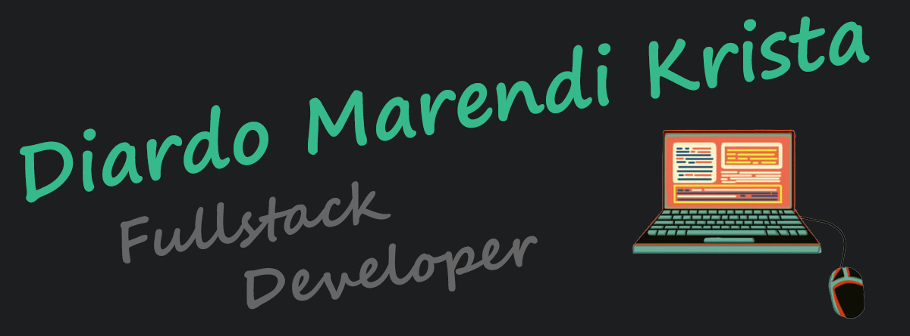

  

<h1 align="center">👋 Hi, I'm <a href="https://www.linkedin.com/in/diardo/" target="_BLANK">Diardo Marendi Krista</a>!</h1>

  ## 👨 About Me

  A person who passionate about software development, technology, and general knowledge.
  Spend almost all of my time in front of my computer because I love to browsing and explore.

  Experienced in Aviation, Passenger/Customer Service and Administration since 2011, makes me familiar with various work environments & colleagues, both domestic and abroad colleagues. and also make me accustomed to adapting to any environments.

## &#x1f4c8; GitHub Stats
I active on AWS CodeCommit, so my git not so updated

 

  ## 💼 Skills

 ##    

  <strong><a href="https://www.linkedin.com/in/diardo/" target="_BLANK">LinkedIn</a></strong> |
  <strong><a href="https://www.instagram.com/diardomarendikrista/" target="_BLANK">Instagram</a></strong> |
  <strong><a href="https://www.facebook.com/diardo.krista/" target="_BLANK">Facebook</a></strong>

❤ I'm currently working as Frontend Developer, 3D Developer using Three JS, and building Game Server (ARK: Survival, Ragnarok Online & Minecraft) for fun

<!--
**diardomarendikrista/diardomarendikrista** is a ✨ _special_ ✨ repository because its `README.md` (this file) appears on your GitHub profile.

Here are some ideas to get you started:

- 🔭 I’m currently working on ...
- 🌱 I’m currently learning ...
- 👯 I’m looking to collaborate on ...
- 🤔 I’m looking for help with ...
- 💬 Ask me about ...
- 📫 How to reach me: ...
- 😄 Pronouns: ...
- ⚡ Fun fact: ...
-->
